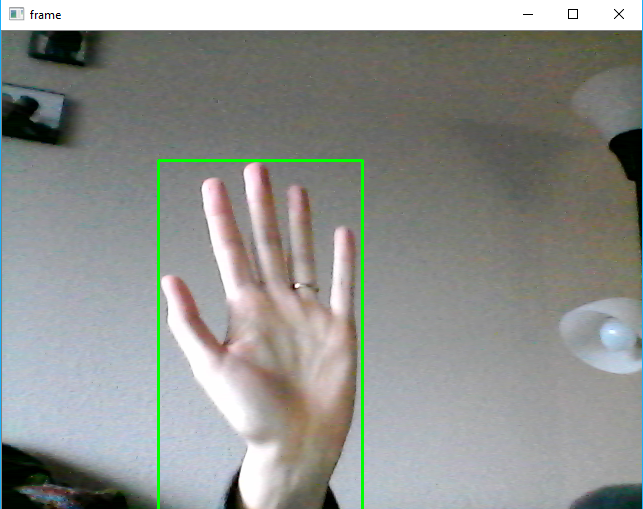
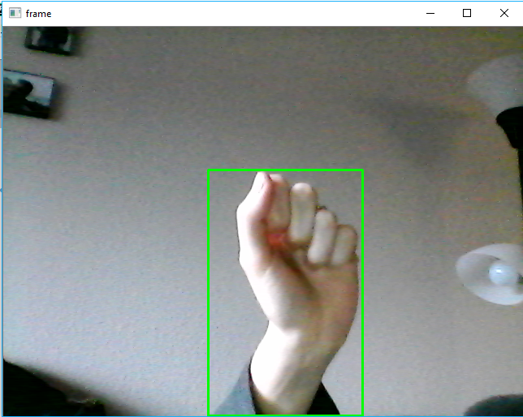

# motionDetection

Script detects motion by utilizing background subtraction, thresholding, and contouring. The script requires a few seconds to settle on a background (assumes that anything not moving in the first few seconds is the background), then once motion is detected, a green box is drawn around the motion. Below shows two examples of detected motion

